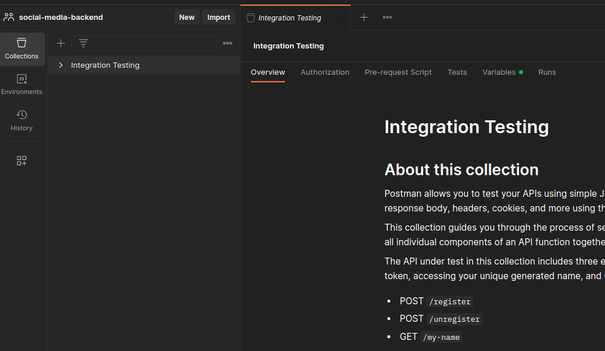
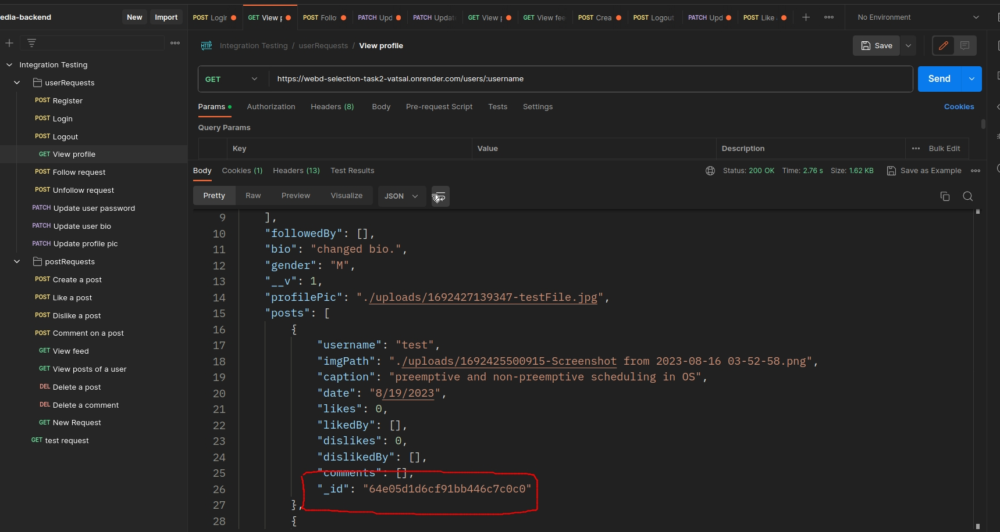

# WebD-Selection-Task-2

<ins>**Name**</ins>: Vatsal Bhuva <br />
<ins>**Enrollment Number**</ins>: IIT2022004 <br />
<ins>**WhatsApp Number**</ins>: 7041741104 <br />
<ins>**Bucket**</ins>: Backend <br />

<hr>
<h1>The Social Media Mastery </h1>
<p> A fully functioning social media website's backend, crafted together using <strong><i style="color: rgb(227, 177, 51)">Express, Node.js, Multer, bcrypt, and more! </i></strong>

<h2 style="border-bottom: none"><ins>Installation</ins></h2>
As this application is composed entirely of the backend part of a social media website,
we require <strong style="color: rgb(227, 177, 51)">Postman</strong> to make <span style="color: rgb(227, 177, 51)">HTTP requests</span> to the various
routes. <br><br>

<strong>Windows (x64):</strong>
```
https://dl.pstmn.io/download/latest/win64
```
<strong>Linux (x64):</strong>
```
https://dl.pstmn.io/download/latest/linux_64
```
<strong>Linux (arm64)</strong>:
```
https://dl.pstmn.io/download/latest/linux_arm64
```
<strong>MacOS (Intel Chip)</strong>:
```
https://dl.pstmn.io/download/latest/osx_64
```
<strong>MacOS (Intel Chip)</strong>:
```
https://dl.pstmn.io/download/latest/osx_arm64
```
<hr>

<h2>Usage
</h2>

<li>Paste this Postman link in your browser to view the requests you can make: </li>

```
https://app.getpostman.com/join-team?invite_code=969a4684da6a66b6ff57b83eeb049cca&target_code=de1c96afc48f36811ff9f904a023471c
```

<li>Expand the 'Integration Testing' tab to view the titles of the different requests that you make</li><br>



<li>The userRequests tab enlists all the user-related options that are available for this social media website. Likewise, the postRequests tab enlists all the post-related options that a user can make.</li><br>


<li>To get started, click on the "Register" option under the userRequests tab. Under the "Body" section on the right, and under the "x-www-form-urlencoded" tab, enter the details of the user that you want to register as (remember your username and password!)</li><br>


<li>Once registered, head over to the "Login" section, and login with the correct credentials. Without logging in, you will not be able to access the various different functionalities, other than being able to view the profile of users (just like instagram allows you to view the profile of another user without logging in.)</li><br>


<li>Upon successfully logging in, you should receive a "token" in the response section at the bottom. This is your JWT token, which is used to authenticate you as a logged in user across the different routes. You don't need to store the token anywhere, it's taken care of by 🍪 ;)</li><br>


<hr>
Let's have a look at the different functionalities of the website, and how to use them.

<h3> User Requests </h3>
<li><ins>Logout</ins>: Nothing to do; click on the send option to log out from the currently logged in user.</li>

<li><ins>View profile</ins>: This lets you view the profile information of any user. It does not require for you to be logged in. Type in the username of the user who's profile you want to view under the "Params" tab, not the "Body" tab like we've been doing so far.
</li><br>


<li><ins>Follow request:</ins> Want to make friends? Follow them up! Following a user lets you see their posts in your feed. Enter their username in the "Params" tab to follow them.
</li><br>

<li><ins>Unfollow request:</ins> Same functionality as the Follow feature.
</li><br>

<li><ins>Update user password:</ins> Didn't I tell you to remember your password? No worries, got your back. Head over to this request to change your password. The new password should be entered as the value to the password attribute under the "Body -> x-www-urlencoded" tab.
</li><br>


<li><ins>Update user bio:</ins> Let others get to know more about you through your bio! Update your bio using this request, and showcase your specs!
</li><br>

<li><ins>Update profile pic:</ins> Haven't seen me yet? View my profile pic! Under the "Body -> form-data" section, select the profile pic that you want to upload!
</li><br>


<strong>Note: the profile won't be visible as this is just the backend part. The image can, however, be rendered using frontend as the image's relative path is stored in the database. The same applies to viewing a user's posts as well.</strong>


<hr>

<h3> Post Requests </h3>

<li><ins>Create post:</ins> Share where you've been this summer or your outing with your friends and much more! Head over to the "Body -> form-data" section, and select the image/video that you want to post! Don't forget to add a suitable magical caption to captivate your followers!
</li><br>


<li><ins>Like a post:</ins> Show your support to your close ones by liking their posts! Under the "Params" section, enter the username to whom the post belongs, and the ID of the post that you want to like. <strong>NOTE: the postID can be obtained by viewing the posts/profile of that user, and in the posts array will be listed all the posts with each post having a unique "_id" attribute. Copy the inner text (don't copy the ObjectID part) and paste it in the postID attribute.
(don't be cheeky to like your own post or like the same post twice :) i've got that covered :))
</li><br>




<li><ins>Dislike a post: </ins>Same usage as liking a post.
</li><br>

<li><ins>Comment on a post: </ins>Express (no pun intended) your thoughts on your friend's posts to flatter them :)
Enter the username and the postID (the same way as in liking a post), and enter your comment in the "Body -> x-www-form-urlencoded" section, under the "comment" attribute.
</li><br>


<li><ins>View feed: </ins>Following your friends? View what they're upto in your feed! Your feed shows your your following's posts in a randomized order to make it more natural! Just click the send button to view your feed!
</li><br>

<li><ins>View posts of a user: </ins>View the posts of a specific user by heading over to this section, and entering the username of that user under the "username" attribute, in the "Params" section.
</li><br>


<li><ins>Delete a post: </ins>Uploaded the wrong post? Or did you have a "felt cute might delete later" moment? Delete your post right away by mentioning the ID of your post!
</li><br>

<li><ins>Delete a comment: </ins>Didn't like what someone commented on your post? Mention the postID, and the commentID of the comment to delete the comment right away! The postID and the commentID can be obtained by viewing the profile or the posts of a user. The commentID will be the value of the "commIndex" attribute of the specific comment. 
</li><br>

